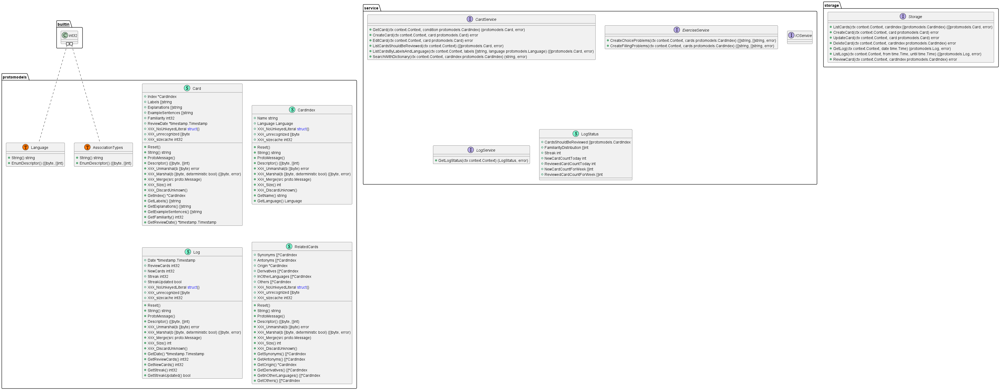

# langdida-server

## UML

## Problem Spaces

### Core Domain

The core domain of langdida-server focuses on providing language learning functionalities such as word lookup, word tracking, scheduling word reviews, generating practice questions, and recording learning progress. It includes the main features that directly support the language learning process.

### Supporting Subdomain

The supporting subdomain of langdida-server includes features that support the core domain, such as user authentication and authorization, data persistence, and API endpoints for handling user requests. These features are essential for the smooth operation of the language learning platform and provide the necessary infrastructure for the core domain functionalities.

### Generic Subdomain

The generic subdomain of langdida-server includes generic functionalities that can be reused in different contexts. For example, it may include utility functions for string manipulation, data validation, error handling, and logging. These generic functionalities are designed to be modular and extensible, making them reusable across different parts of the application and promoting code reusability and maintainability.

## Architecture

langdida-server follows a multi-tier architecture, with clear separation of concerns between different layers. The architecture consists of the following components:

- Frontend: The frontend is responsible for rendering the user interface and handling user interactions. It communicates with the backend via APIs to request data and perform actions.
- Backend: The backend is responsible for processing user requests, executing business logic, and managing data persistence. It is implemented as a RESTful API server using the Express framework in Node.js.
- Data Persistence: The data persistence layer is responsible for storing and retrieving data from a database. It uses a relational database such as MySQL or PostgreSQL to store data related to word definitions, user profiles, word tracking, and learning progress.
- External APIs: langdida-server may interact with external APIs, such as online dictionaries or language learning platforms, to fetch word definitions or generate practice questions. These external APIs are accessed through API clients that handle authentication, authorization, and data retrieval.
